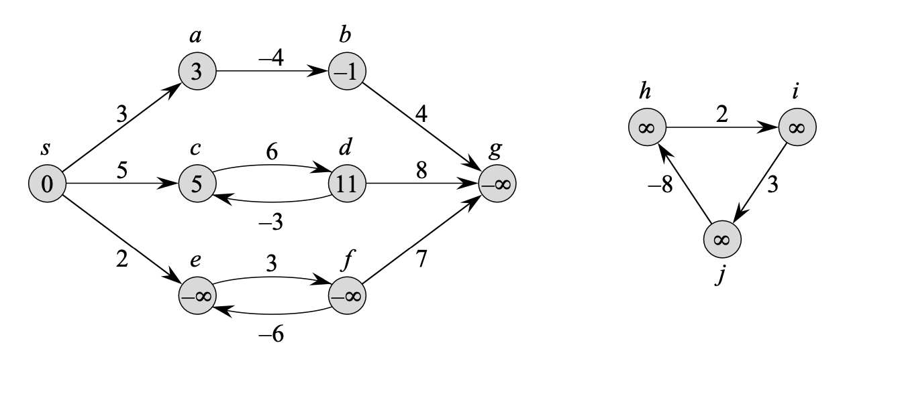

# Shortest-paths problem (최단 경로 문제)
>Introduction to Algorithms 3rd edition 챕터 24를 정리한 내용

# Preface

최단 경로 문제에서, 가중치가 있고 방향이 있는 그래프 $G = (V, E)$ 와  `edge` 를 실수의 가중치(weight)로 매핑하는 $w : E \rightarrow \mathbb{R}$ 함수가 주어진다. 경로 $p = <v_0, v_1, ... ,v_k>$ 의 가중치 $w(p)$ 는 구성하는 `edges`의 합이 된다. 
$$\sum_{i=1}^k w(v_{i-1}, v_i)$$
이때 $u$ 부터 $v$ 까지의 최단 경로(shortest-path weight) $\delta(u, v)$ 는 다음과 같이 정의된다.
$$\begin{equation} \delta(u, v) = \begin{cases} min\{w(p) : u \rightsquigarrow^{p}v \}, & \text{if there is a path from u to v}. \\ \infty, & \text {otherwise}. \end{cases} \end{equation}$$
이때 $u$ 부터 $v$ 까지의 경로 $p$ 중 $w(p) = \delta(u, v)$ 를 만족하는 $p$가 된다.

edge의 가중치는 거리 뿐만 아니라 소요시간, 비용, 패널티, 손실 혹은 알고리즘에서 최소화 하기 위한 어떤 값이든 될 수 있다.

## Variants
이 챕터에선 single-source shortest-paths problem, 즉 주어진 그래프 $G = (V, E)$ 에서 시작점 $s \in V$ 부터 각 점 $v \in V$ 까지 최단 경로를 찾는 문제에 집중해서 알아보자. 이 single-source problem을 위한 알고리즘은 다음과 같은 varients를 포함하는 여러 문제를 해결할 수 있다.
**Single-destination shortest-paths problem:** 
	주어진 목적지 정점 $t$ 에 도착하는 각 정점 $v$ 로부터 최단경로를 구하는 문제. 그래프의 각 edge의 방향을 reversing하여 이 문제를 single-source problem으로 해결할 수 있다.
**Single-pair shortest-path problem:**
	주어진 $u$, $v$ 가 있을 때, $u$ 에서 $v$ 로 가는 최단경로를 구하는 문제. source vertex $u$ 에 대하여 single-source problem을 풀면, 이 문제 또한 해결할 수 있다. 게다가, 이 문제를 해결하기 위한 방법으로 알려진 모든 알고리즘들은 worst-case에서 점근적인(asymptotic) 런타임 소요 시간은 최상의 single-source algorithms과 동일하다.
**All-pairs shortest-paths problem:**
	정점 $u, v$ 의 모든 pair를 위해 $u$에서 $v$로 가는 최단경로를 찾는 문제. 비록 각 정점들에 대해 single-source algorithm을 실행하여 문제를 해결할 수 있지만, 보통 더 빠른 방법으로 해결할 수 있다. 게다가, 그 구조는 그 자체로 흥미로우며 그 내용은 따로 다루게 될 것이다.

## optimal substructure of a shortest path
촤단경로 알고리즘은 주로 두 정점의 최단거리는 다른 최단거리를 포함한다는 성질에 의존한다. 이는 DP 및 Greedy 에서 적용되는 성질과 유사하다. Dijkstra 알고리즘은 그리디 알고리즘이고, Floyd-Warshall 알고리즘은 DP 알고리즘이다. 다음과 같은 lemma는 최단 경로의 optimal-substructure property 를 더 정밀하게 해준다.

### *Lemma 24.1 (Subpaths of shortest paths are shortest paths)*

  가중치가 있고 방향이 있는 그래프 $G = (V, E)$ 와 weight function $w : E \rightarrow \mathbb{R}$ 가 주어졌을 때, $p = < v_0, v_1, ... , v_k>$ 를 정점 $v_0$ 에서 $v_k$ 로 가는 최단경로라 하자. 그리고 임의의 $0 \leq i \leq j \leq k$ 를 만족하는 $i, j$ 에 대하여 $p_{ij} = <v_i, v_{i+1}, ..., v_j>$ 를 정점 $v_i$ 에서 $v_j$ 로 가는 subpath라고 하자. 그러면 $p_{ij}$는 $v_i$ 에서 $v_j$ 로 가는 최단 경로이다.

#### *proof*
  경로 $p$를 $v_0 \rightsquigarrow^{p_{0i}} v_i \rightsquigarrow^{p_{ij}} v_j \rightsquigarrow^{p_{jk}} v_k$ 로 분해하면, $w(p) = w(p_{0i}) + w(p_{ij}) + w(p_{jk})$ 가 된다. 이제, $v_i$ 에서 $v_j$ 로 가는 path $p_{ij}^`$ 가 존재하며 $w(p_{ij}^`) < w(p_{ij})$ 를 만족한다고 하자. 그러면 $v_0 \rightsquigarrow^{p_{0i}} v_i \rightsquigarrow^{p_{ij}^`} v_j \rightsquigarrow^{p_{jk}} v_k$ 는 $v_1$ 에서 $v_k$ 로 가면서 가중치 $w(p_{0i}) + w(p_{ij}^`) + w(p_{jk})$  를 가지는데, 이는 $w(p)$보다 작아지게 되며 이는 $p$가 $v_0$ 에서 $v_k$로 가는 가정에 모순된다.

## Negative-weight edges

>*출처 : Introduction to Algorithms 3rd p646*
>*$e, f, g$는 negative-weight cycle을 가져서 weight가 $-\infty$ 이고, $h, i, j$ 는 negative-weight cycle을 가지지만 $s$에서 도달가능하지 않기 때문에 weight가 $\infty$ 이다. 

종종 single-source 최단경로 문제는 음의 가중치를 가진 edge를 포함할 수 있다. 만약 그래프 $G=(V, E)$ 가 source $s$로 부터 도달가능한 "음의 가중치 사이클(negative weight cycles)"이 존재하지 않는다면, 모든 $v \in V$ 에서 최단 경로 가중치 $\delta(s, v)$ 는 음의 가중치가 되더라도 잘 정의된다. 하지만 도달 가능한 "음의 가중치 사이클(negative weight cycles)"이 존재한다면, 최단경로의 가중치는 잘 정의되지 않는다. $s$에서 사이클 위의 다른 점으로 가는 path는 negative-weight cycle을 돌면서 더 짧은(shortest) path를 가지게 되기 때문이다. 따라서 $s$ 에서 $v$로 가는 경로에 negative-weight cycle이 존재한다면 $\delta(s, v) = -\infty$ 로 정의한다.

`Dijkstra` 알고리즘의 경우 모든 edge의 가중치는 음이 아니라고 가정하고, `Bellman-Ford` 알고리즘은 음의 가중치를 가지는 edge를 허용하며, source에서 도달가능한 negative-weight cycle이 없을 때 정확한 답을 구해준다. 보통, negative-weight cycle가 존재하면 알고리즘은 이를 탐지해내게 된다.

## Cycles
최단경로에선 cycle이 포함되지 않는다. 
- 음의 가중치를 갖는 cycle은 위에서 살펴보았듯, 포함되지 않는다.
- 0이 아닌 양의 가중치를 갖는 cycle의 경우, `source` 에서 `destination` 까지 더 작은 weight를 가지는 경로로 움직이기 때문에, cycle가 존재할 수 없다. 즉, 만약 $p = <v_0, v_1, ... , v_k>$ 가 경로이고 $c = <v_i, v_{i + 1}, ... , v_j>$ 가 이 경로의 양의 가중치를 갖는 cycle (positive-weight cycle)이면 (이때 $v_i = v_j \text{ and } w(c) \gt 0$) 경로 $p^`  = <v_0, v_1, ..., v_i, v_{j+1}, v_{j+2}, ..., v_k>$ 는 가중치 $w(p^`) = w(p) - w(c) < w(p)$ 를 가지기 때문에 $p$는 $v_0$에서 $v_k$ 로 가는 최단경로가 될 수 없다.
- 0의 가중치를 갖는 cycle은 어떤 경로에서든 0의 가중치를 갖는 cycle을 제거할 수 있다. 따라서, 만약 source $s$에서 destination $v$ 로 가는 최단경로에 0의 가중치를 갖는 cycle가 있다면, 이 cycle이 없는 또다른 최단경로가 존재하게 된다. 최단경로에 0의 가중치를 갖는 cycle이 존재하는 한, 이 cycle이 더이상 존재하지 않을 때 까지 제거할 수 있다.
그러므로, 최단경로를 찾을 때, cycle이 존재하지 않는 simple paths들로 구성된다 라는 일반적인 특징을 잃지 않을 수 있다.
따라서 어떤 그래프 $G = (V, E)$ 안에 acyclic path는 최대 $|V|$의 서로 다른 정점들로 구성되고, 또한 최대 $|V| - 1$ 개의 edge들로 구성된다. 

## Representing shortest paths
종종 최단경로의 가중치 뿐만 아니라 그 최단경로 위의 정점들을 구하고 싶을 수 있다. 그래프 $G = (V, E)$ 가 주어졌을 때, 각 정점 $v \in V$ 를 `predecessor v` 로 저장(maintain)한다. $\pi$ 는 또다른 정점이거나 `NIL` 이다. 이 문서의 최단경로 알고리즘에선 정점 $v$에서 유래한 `predecessor`들의 chain이 $s$ 부터 $v$ 까지 최단경로를 따라 거꾸로 가도록 `π attribute`를 정의한다. 즉, $v.\pi \ne NIL$ 인 정점 $v$ 가 주어졌을 때, `Print-Path(G, s, v)`는 $s$ 부터 $v$ 까지의 최단경로를 출력한다.
```python
Print-Path(G, s, v)
	if v == s
		print s
	else if v.π == NIL
		print "no path from" s "to" v "exists"
	else Print-Path(G, s, v.π)
		print v
```

하지만 최단경로 알고리즘을 실행하는 도중에, π 값이 최단경로를 나타내지 않을 수 있다. BFS때와 마찬가지로, π 값에 의해 구해진 `predecessor subgraph` $G_π = (V_π, E_π)$ 를 생각해야 한다. 이때 정점의 집합 $V_π$ 는 `non-NIL predecessors` 로 구성된 정점의 집합 $G$ 와 `source` $s$ 의 합으로 정의한다.
$$V_π = \{ v \in V : v.π \ne NIL\} \cup \{s\}$$
방향이 있는 edge 집합 $E_π$ 는 $V_π$ 에 있는 정점들의 π 값에 의해 추론된 edge들의 집합이다.
$$E_π = \{(v.π, v) \in E : v \in V_π - \{s\}\}$$
이 문서에 나와있는 최단경로 알고리즘에 의해 만들어진 π 값들은 $G_π$ 가 종료되는 때가 `shortest-paths tree`  (즉, `source` $s$ 에서 $s$로 부터 도달가능한 모든 정점까지의 최단 경로를 포함하는 `rooted tree` ) 가 되는 성질이 있다는 것을 증명할 수 있다. `shortest-paths tree`는 `breadth-first tree`와 비슷하지만, edge의 개수 대신에 edge의 weight에 관한 `source` 로부터 최단경로를 포함하게 된다. 더 정확히 말하자면, 가중치가 있고, 방향이 있는 그래프 $G = (V, E)$를 정의하고 이 그래프의 weight function 이 $w : E \rightarrow \mathbb{R}$ 이며 shortest path들이 잘 정의 되도록 $G$에 `source` 정점 $s$ 에서 도달가능한 `negative-weight cycle` 이 존재하지 않는다고 가정한다. $s$를 `root`로 하는 `shortest-paths tree` 는 `directed subgraph`  $G^` = (V^`, E`) \text{ where } V^` \subseteq V \text{ and } E^` \subseteq E$ 이고 이때, 
1. $V^`$ 는 $G$ 안의 $s$에서 도달가능한 정점들의 집합
2. $G^`$ 는 `root`가 $s$인 `rooted tree`를 만들고,
3. 모든 $v \in V^`$ 에 대하여, $G^`$ 안의 $s$ 에서 $v$ 로 가는 유일한 `simple path`는 $G$ 안의 $s$ 에서 $v$로 가는 최단경로이다.
![[shortestPathTree.png]]
> 출처: introduction to algorithms 3rd ed, p648
> (a) : `source` $s$ 로 부터 최단 경로인 가중치와 방향이 있는 그래프
> (b) : 색칠된 edge는 `source` $s$ 를 `root`로 하는 `shortest-paths tree`를 형성한다.
> (c) : 같은 `root`를 가지는 또다른 `shortest-paths tree`

최단경로는 꼭 하나만 존재할 필요 없으며, `shortest-paths tree`도 그렇다. 예를 들면, 위 그림은 같은 `root`에서 두개의 `shortest-paths trees` 가 나타난다.

## Relaxation
이 챕터에서 알고리즘들은 `relaxation`이란 테크닉을 사용한다. 각 정점 $v \in V$ 에 대하여, $v.d$ 라는 `attribute`를 저장(maintain)하며, 이 `attribute`는 `source` $s$ 에서 $v$ 로 가는 최단경로 가중치의 `upper bound`를 의미한다. 이 $v.d$를 `shortest-path estimate`라고 명명하자. `shortest-path estimate`와 `predecessors(π)`를 다음 $\Theta(V)$ -time의 절차를 통해 초기화한다.
```python
# pseudo code
Initialize-single-source(G, s)
	for each vertex v in G.V
		v.d = ∞
		v.π = NIL
	s.d = 0
```
```cpp
// c++ code
void initializeSingleSource(Graph &G, Vertex &s){
	for (auto &v : G.V){
		v.d = INF;
		v.pi = nullptr;
	}
	s.d = 0;
}
```

edge ($u, v$)에 `relaxing` 하는 과정은 다음 $O(1)$-time의 절차를 통해 진행된다.
```python
# pseudo code
Relax(u, v, w)
	if v.d > u.d + w(u,v)
		v.d = u.d + w(u,v)
		v.π = u
```
```cpp
// c++ code
void Relax(Vertex &u, Vertex &v, function<int(Vertex&, Vertex&)> > w){
	if (v.d > u.d + w(u, v)){
		v.d = u.d + w(u, v);
		v.pi = u;	
	}
}
```
이 장의 알고리즘들은 `Initialize-single-source`를 호출하고 여러번 edge들을 relaxing 한다. 게다가, `relaxation` 는 `shortest-path estimates`와 `predecessor`가 바뀌는 유일한 수단이 된다. 각 알고리즘 들은 각 edge를 몇 번 relax 하는가, 그리고 어떤 순서로 edge를 relax 하는가에 따라 달라진다. `Dijkstra` 알고리즘과 `directed cyclic graph`를 위한  `shortest-paths`알고리즘은 각 edge를 정확히 한번만 `relaxing` 한다. `Bellman-Ford` 알고리즘은 각 edge를 $|V| - 1$ 번 relaxing 한다.

## Properties of shortest paths and relaxation
이 챕터의 알고리즘들을 증명하기 위해서, `shortest path`와 `relaxation`에 관한 몇가지 성질들을 살펴보자. 각 성질에서, 그래프는 `Initialize-single-source(G, s)` 를 통하여 초기화 되어 있고, `shortest-path estimates`와 `predecessor subgraph`는 일련의 `relaxation step`을 통해서 바뀐다고 가정하자.

- **Triangle inequality**
	- 어떤 $edge(u, v) \in E$ 에 대하여, $\delta(s, v) \leq \delta(s, u) + w(u, v)$ 이다.
- **Upper-bound property**
	- 항상 모든 정점 $v \in V$ 에 대하여, $v.d \geq \delta(s,v)$ 이며 한번 $v.d$가 값 $\delta(s,v)$ 를 가지면 절대 변하지 않는다.
- **No-path property**
	- $s$ 에서 $v$로 가는 경로가 없으면, 항상 $v.d = \delta(s,v) = \infty$ 이다.
- **Convergence property**
	- 만약 어떤 $u, v \in V$ 에 대하여 $s \rightsquigarrow u \rightarrow v$ 는 $G$ 안의 최단경로 이고, $edge (u,v)$ 를 `relaxing` 하기 전 어느 때나 $u.d = \delta(s, u)$ 이면, 그 후 항상 $v.d = \delta(s, v)$ 이다.
- **Path-relaxation property**
	- 만약 $p = <v_0, v_1, ..., v_k>$ 가 $s = v_0$ 에서 $v_k$ 로 가는 최단경로 이고, $p$의 edge들을 $(v_0, v_1),(v_1, v_2), ... , (v_{k-1}, v_k)$ 의 순서로 `relax` 했다면, $v_k.d = \delta(s, v_k)$이다.
	- 이 성질은 $p$의 edge의 `relaxation`과 섞이는 상황까지 포함하여, 어떤 다른 `relaxation step`가 발생하더라도 무관하게 유지된다.
- **Predecessor-subgraph propery**
	- 모든 $v \in V$ 에 대하여 일단  $v.d = \delta(s, v)$를 만족하면, `predecessor subgraph`는 $s$를 `root`로 하는 `shortest-paths tree`이다.


후술할 알고리즘에서, directed graph $G$ 는 adjacency-list으로 저장되어 있다고 가정하며, weight를 같이 저장하기 때문에 edge의 weight을 구하는데 $O(1)$의 시간이 걸린다고 가정한다.

# The Bellman-Ford algorithm
**Bellman-Ford algorithm**은 single-source shortest-path 문제의 일반적인 해결책으로, edge의 가중치가 음수인 상황에서도 작동한다. 가중치와 방향이 있고 `source` 가 $s$ 이며 weight function이 $w : E \rightarrow \mathbb{R}$ 인 그래프 $G = (V, E)$가 주어졌을 때, `Bellman-Ford algorithm`은 source에서 도달할수 있는 negative-weight cycle이 있는지 여부를 `boolean`값으로 리턴한다. 만약 이런 cycle가 있으면, 해답이 존재하지 않다는 것을 의미하고, cycle이 없으면, `shortest path`와 그 가중치를 구한다.
이 알고리즘은 edge들을 relaxing 하고, 실제 최단경로의 가중치인 $\delta(s, v)$ 가 될 때 까지, `source` $s$ 에서 각 정점 $v \in V$ 까지의 최단 경로 가중치 `estimate v.d` 를 점진적으로 감소시킨다.
```python
# pseudo code
Bellman-Ford(G, w, s)
1:	Initialize-single-source(G, s)
2:	for i = 1 to |G.V| - 1
3:		for each edge (u,v) in G.E
4:			Relax(u, v, w)
5:	for each edge(u, v) in G.E
6:		if v.d > u.d + w(u, v)
7:			return false
8:	return true
```
```cpp
// c++ code
bool bellmanFord(Graph &G, function<int<Vertex &, Vertex&> > w, Vectex &s){
	initializeSingleSource(G, s);
	for (int i = 1; i < G.size() - 1; ++i){
		for (auto &edge : G.E)
			Relax(edge.u, edge.v, w);
	}
	for (auto &edge : G.E){
		if (edge.v.d > edge.u.d + w(edge.u, edge.v))
			return false;
	}
	return true;
}
```
![[bellmanFordExample.png]]
> 출처: introduction to algorithms 3rd ed, p652
> Bellman-Ford 알고리즘의 작동 과정

Bellman-Ford 알고리즘은 $O(VE)$-time 의 시간복잡도를 가지며, 초기화에 $\Theta(V)$time 이 소요되고(line 1), $|V| - 1$ 번만큼 for 루프를 돌면서 각 edge들을 체크하고($\Theta(E)$) (line 2-4) 마지막 for 루프에서 $O(E)$의 시간이 소요된다.
`Bellman-Ford` 알고리즘의 정확성을 증명하기 위해서, negative-weight cycle가 없다면 `source` 에서 도달 가능한 모든 정점들에 대하여 알고리즘이 정확한 shortest-path weight을 계산한다는것을 보이자.

### *Lemma 24.2*

  $G = (V, E)$ 를 가중치와 방향이 있고 source $s$ 와 weight function $w : E -> \mathbb{R}$ 을 가지는 그래프 라고 하자. 이때 $G$ 에는 $s$에서 도달가능한 negative-weight cycles가 없다고 가정하자. 그러면 $|V| - 1$ 번의 반복을 통하여 $s$ 에서 도달 가능한 보든 정점 $v$에 대하여 $v.d = \delta(s, v)$ 를 구할 수 있다.

#### *Proof*

  *lemma*를 증명하기 위해 path-relaxation 성질을 생각해보자. $s$에서 도달가능한 어떤 정점 $v$ 를 고려해보자. 그리고 $v_0 = s$, $v_k = v$ 는 $s$에서 $v$로 가는 어떤 최단 경로를 $p = <v_0, v_1, ..., v_k>$ 라 하자. `Shortest paths`들은 simple 이기 때문에, $p$는 최대 $|V| - 1$ 개의 edge를 가지고, 따라서 $k \leq |V| - 1$ 이다. 각 $|V| - 1|$ 의 for loop 반복은 모든 $|E|$ edge들을 relaxing 한다. $i$번째 반복에서 `relax`된 edge들은, $i = 1, 2, ... , k$ 인 $(v_{i - 1}, v_i)$ 이다.  `path-relaxation property` 에 의하여, $v.d = v_k.d = \delta(s, v_k) = \delta(s, v)$ 이다. 

### Corollary 24.3
  
  $G = (V, E)$ 를 가중치와 방향이 있고 source $s$ 와 weight function $w : E -> \mathbb{R}$ 을 가지는 그래프 라고 하자. 그리고 $G$ 는 $s$에서 도달가능한 `negative-weight cycle`이 존재하지 않는다고 가정하자. 그러면, 각 정점 $v \in V$ 에 대하여 $s$에서 $v$로 가는 필요충분 조건은 `Bellman-Ford`를 $G$에 대하여 실행했을때, $v.d < \infty$ 로 종료되었을 때 이다.

### Theorem 24.4 (Correctness of the Bellman-Ford algorithm)

  `Bellman-Ford`를 $G$ 에 적용하는데, 이때  $G = (V, E)$ 를 가중치와 방향이 있고 source $s$ 와 weight function $w : E -> \mathbb{R}$ 을 가지는 그래프 라고 하자. 만약 $G$가 souece $s$에서 도달 가능한  `negative-weight cycle` 를 포함하지 않으면, `true`를 반환하고, 모든 정점 $v \in V$ 에 대하여 $v.d = \delta(s, v)$ 를 구할 수 있으며 `predecessor subgraph`인 $G_π$ 는 $s$를 `root`로 하는 `shortest-paths tree` 이다. 만약 $G$ 가 $s$에서 도달가능한 `negative-weight cycle`을 가진다면, `false`를 반환한다.

#### *proof*
  그래프 $G$ 가 source $s$ 에서 도달가능한  `negative-weight cycle`  을 포함하지 않는다고 가정해보자.  일단, 모든 정점 $v \in V$ 에 대하여 종료시 $v.d = \delta(s, v)$ 를 만족한다는 `claim`을 증명해보자. 만약 $v$가 $s$에서 도달가능하다면, *lemma 24.2*가 이 `claim`을 증명한다. 만약 $v$가 $s$에서 도달가능하지 않다면, 이 `claim`은 `no-path property`를 따르게 된다. 따라서, 모든 상황에 대하여 증명이 된다. 이 `claim`과 함께,  `predecessor-subgraph property`는 $G_π$ 가 `shortest-paths tree`임을 암시한다. 이제 이 `claim`을 `Bellman-Ford`에서 `true`를 반환한다는것을 보이기 위해 사용해보자. 종료시, 모든 $edges (u, v) \in E$ 에 대하여,  $$\begin{equation}
\begin{split}
v.d & = \delta(s, v) \\
	& \leq \delta(s, u) + w(u, v)\text{\qquad (by the triangle inequality)}\\
	& = u.d + w(u, v),
\end{split}
\end{equation} $$
이고, 따라서 `Bellman-Ford` pseudo code에서 `false`를 반환하는 상황은 없다.
이제, 그래프 $G$가 $s$에서 도달 가능한 negative-weight cycle이 존재한다고 가정해보자. 이 cycle을 $v_0 = V_k$ 일때, $c = <v_0, v_1, ..., v_k>$ 라고 하자. 그러면, $$ \sum_{i=1}^k w(v_{i-1}, v_i) < 0 \text{\qquad(24. 1)}.$$
반례를 도출하기 위해 `Bellman-Ford` 알고리즘에서 `true`를 반환한다고 가정해보자. 그러면, $v_i.d \leq v_{i - 1}.d + w(v_{i -1}, v_i) \text{ for } i = 1, 2, ..., k$ 이다. cycle $c$에서 부등식들을 더하면,
$$\begin{split}
\sum_{i=1}^k v_i.d & \leq \sum_{i=1}^k(v_{i-1}.d + w(v_{i-1}, v_i))\\
					& = \sum_{i=1}^kv_{i-1}.d + \sum_{i=1}^kw(v_{i-1}, v_i).
\end{split}$$
$v_0 = v_k$ 이기 때문에, $c$의 각 정점들은 각 $\sum_{i=1}^k v_i.d$ 와 $\sum_{i=1}^k v_{i-1}.d$ 에서 한번만 나타나고, 그래서 $$\sum_{i=1}^kv_i.d = \sum_{i=1}^kv_{i-1}.d.$$
게다가, *Corollary 24.3* 에 의하여, $v_i.d \text{ for } i = 1, 2, ..., k$ 는 유한하다. 그러므로 $$ 0 \leq \sum_{i=1}^kw(v_{i-1}, v_i)$$이며 이는 부등식 (24.1)에 모순이다. 따라서 `Bellman-Ford` 알고리즘은 그래프 $G$에 `source`에서 도달가능한 `negative-weight cycle`이 존재하지 않는다면 `true`를 반환하고, 그렇지 않으면 `false`를 반환한다.