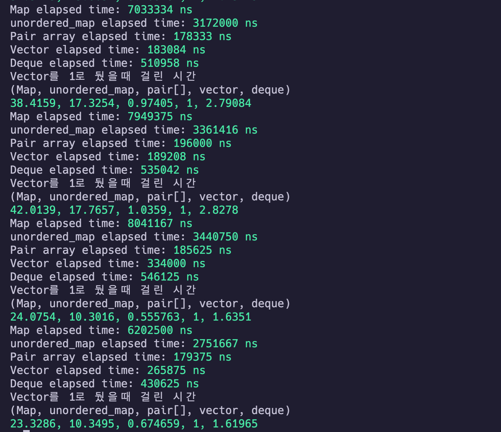

# C++ 퍼포먼스 테스트 기록

## 정렬된 key-value 삽입 연산

### 테스트 코드

[test code](mapPerformanceTest.cpp)

### 실행 결과

[test.log에 로그를 기록](test.log)하고 각 column별로 평균을 냄.

225개 평균
|자료구조|걸린시간 (상대값)|
|-|-|
| `map`| 34.9322 |
|`unordered_map`|15.6107|
|`pair<int int>[]`| 1.0311|
|`vector<pair<int int>>`| 1|
|`deque<pair<int, int>>`| 2.5448|

### 결론

`vector<pair<int, int>> < pair<int, int> [] < deque<pair<int, int>> < unordered_map<int, int> < map<int, int>`
